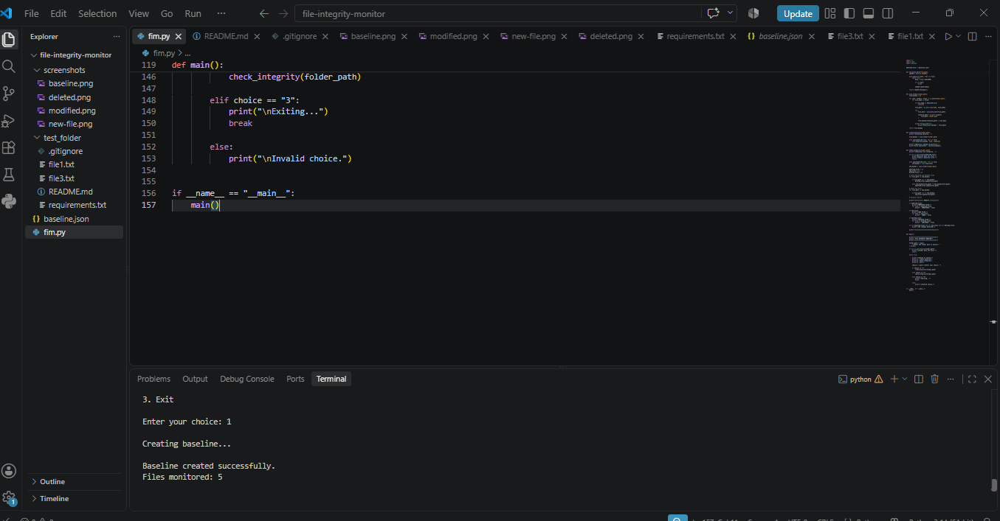
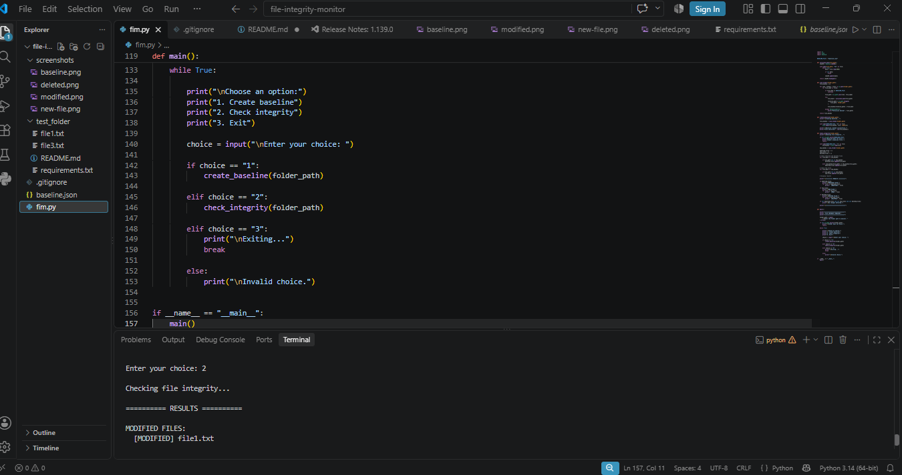
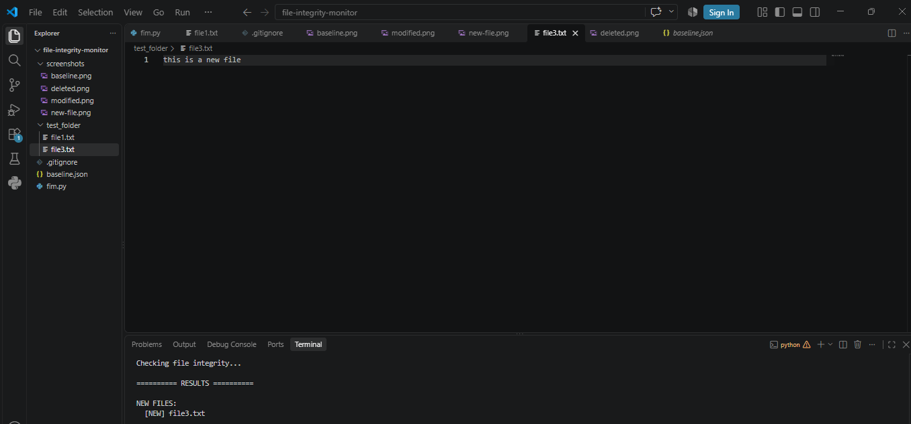
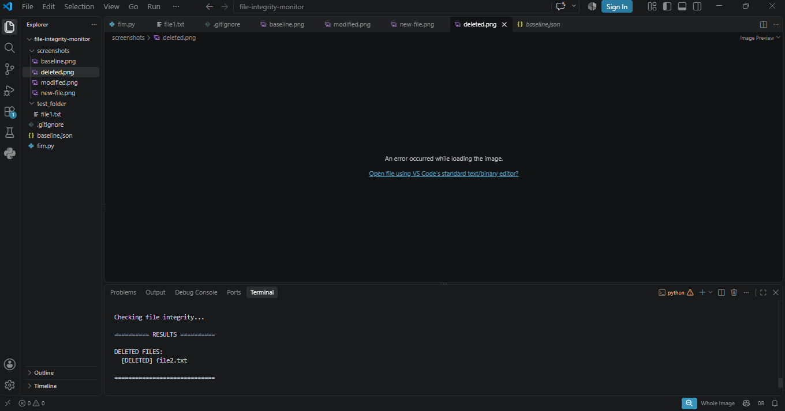

# 🔐 File Integrity Monitoring System


A Python-based **File Integrity Monitoring (FIM)** system that detects changes made to files inside a monitored directory using **SHA-256 cryptographic hashing**.

The project creates a baseline of file hashes and compares them with hashes from later scans to identify **modified, new, and deleted files**.

---

## 📌 Overview

File Integrity Monitoring is a cybersecurity technique used to identify unexpected changes to files.

This project demonstrates the basic concept of FIM by:

* Creating a baseline of files and their SHA-256 hashes
* Scanning the monitored folder
* Comparing current hashes with the baseline
* Detecting modified files
* Detecting newly created files
* Detecting deleted files

The project was developed as a hands-on cybersecurity learning project to understand **cryptographic hashing, file systems, integrity verification, and change detection**.

---

## ⚙️ How It Works

```text
                 ┌─────────────────────┐
                 │   Select Folder     │
                 │     to Monitor      │
                 └──────────┬──────────┘
                            │
                            ▼
                 ┌─────────────────────┐
                 │   Scan All Files    │
                 └──────────┬──────────┘
                            │
                            ▼
                 ┌─────────────────────┐
                 │ Calculate SHA-256   │
                 │       Hashes        │
                 └──────────┬──────────┘
                            │
                            ▼
                 ┌─────────────────────┐
                 │   Create Baseline   │
                 │     baseline.json   │
                 └──────────┬──────────┘
                            │
                     Later Scan
                            │
                            ▼
                 ┌─────────────────────┐
                 │ Calculate Current   │
                 │       Hashes        │
                 └──────────┬──────────┘
                            │
                            ▼
                 ┌─────────────────────┐
                 │ Compare With        │
                 │ Baseline            │
                 └──────────┬──────────┘
                            │
              ┌─────────────┼─────────────┐
              ▼             ▼             ▼
          MODIFIED        NEW          DELETED
            FILES         FILES          FILES
```

---

## ✨ Features

| Feature                    | Description                                            |
| -------------------------- | ------------------------------------------------------ |
| 🔑 SHA-256 Hashing         | Generates a cryptographic hash for each monitored file |
| 📋 Baseline Creation       | Stores the original file hashes                        |
| ✏️ Modification Detection  | Detects when an existing file has changed              |
| 🆕 New File Detection      | Detects files added after the baseline                 |
| 🗑️ Deleted File Detection | Detects files removed after the baseline               |
| 📄 JSON Storage            | Stores baseline hash information in JSON format        |
| 💻 CLI Interface           | Simple command-line menu for operating the system      |

---

## 🛠️ Technologies Used

* **Python 3**
* **SHA-256**
* **JSON**
* **Python `os` module**
* **Python `hashlib` module**
* **Python `json` module**
* **Git**
* **GitHub**

The project uses Python's built-in libraries, so no external Python packages are required.

---

## 📂 Project Structure

```text
file-integrity-monitor/
│
├── fim.py
├── README.md
├── .gitignore
│
├── screenshots/
│   ├── baseline.png
│   ├── modified.png
│   ├── new-file.png
│   └── deleted.png
│
└── test_folder/
    ├── file1.txt
    └── file3.txt
```

### About `baseline.json`

`baseline.json` is generated automatically when the program creates a baseline.

It is intentionally excluded from GitHub using `.gitignore` because it contains runtime baseline data specific to the local test environment.

---

## 🚀 Getting Started

### Prerequisites

Make sure Python is installed.

Check your Python version:

```bash
python --version
```

### Clone the Repository

```bash
git clone https://github.com/Nidhicodes08/file-integrity-monitor.git
```

### Navigate to the Project

```bash
cd file-integrity-monitor
```

### Run the Program

```bash
python fim.py
```

---

## 🖥️ Using the Program

When the program starts, enter the folder you want to monitor:

```text
Enter the folder path to monitor: test_folder
```

The program provides three options:

```text
1. Create baseline
2. Check integrity
3. Exit
```

### 1️⃣ Create Baseline

Select option `1`.

The program calculates SHA-256 hashes for the files and stores them in:

```text
baseline.json
```

Example:

```text
Creating baseline...

Baseline created successfully.
Files monitored: 2
```

### 2️⃣ Check Integrity

Select option `2`.

The program compares the current file hashes with the stored baseline.

It can report:

```text
[MODIFIED] file1.txt
[NEW] file3.txt
[DELETED] file2.txt
```

### 3️⃣ Exit

Select option `3` to close the program.

---

# 📸 Screenshots

## Baseline Creation



The system successfully creates a baseline containing the hashes of the monitored files.

---

## Modified File Detection



The system detects when the contents of an existing file have changed.

---

## New File Detection



The system detects a file that was added after the baseline was created.

---

## Deleted File Detection



The system detects a file that existed in the baseline but is no longer present.

---

## 🔐 Why SHA-256?

SHA-256 is a cryptographic hash function that produces a fixed-length hash value from input data.

For example:

```text
File Content
     │
     ▼
SHA-256 Algorithm
     │
     ▼
Hash Value
```

If the contents of a file change, its SHA-256 hash will normally change as well.

The project uses this property to identify changes in monitored files.

---

## 🎯 Learning Objectives

This project helped me understand practical cybersecurity concepts including:

* File integrity monitoring
* Cryptographic hashing
* SHA-256
* File system operations
* Baseline creation
* Change detection
* JSON data storage
* Python file handling
* Git and GitHub
* Basic cybersecurity monitoring concepts

---

## 🔮 Future Improvements

Possible future versions of the project could include:

* [ ] Real-time file monitoring
* [ ] Timestamped security events
* [ ] Detailed activity logs
* [ ] Email notifications
* [ ] SQLite database integration
* [ ] Web-based dashboard
* [ ] User authentication
* [ ] Automated security reports
* [ ] Configurable monitoring rules
* [ ] Integration with security monitoring systems

---

## ⚠️ Disclaimer

This project was created for **educational and cybersecurity learning purposes**.

It is intended to demonstrate the basic principles of file integrity monitoring and should not be considered a production-grade security monitoring solution.

---

## 👩‍💻 Author

**Nidhi**

B.E. Computer Science Engineering
IoT & Cyber Security including Blockchain Technology

🔗 **GitHub:** https://github.com/Nidhicodes08

---

⭐ If you find this project useful for learning cybersecurity or Python, consider giving the repository a star.
